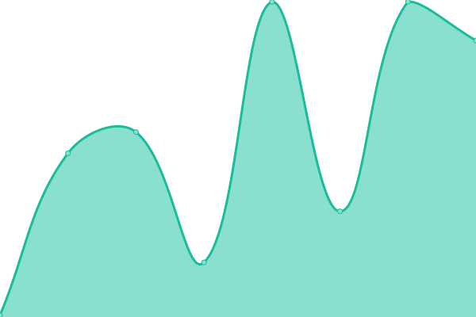
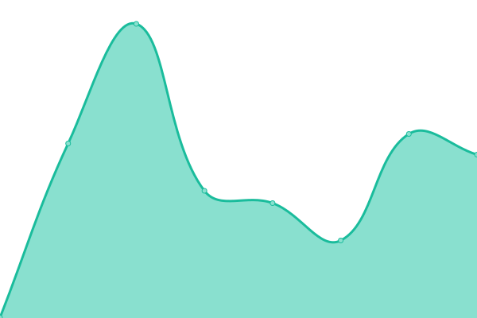
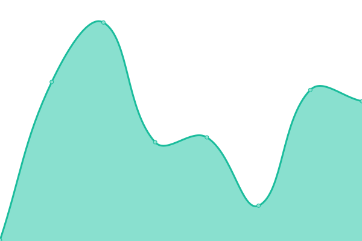

# [📈 Live Status](https://uptime.krsh.eu.org): <!--live status--> **🟩 All systems operational**

This repository contains the open-source uptime monitor and status page for [Krish Gupta](links.krsh.eu.org), powered by [Upptime](https://github.com/upptime/upptime).

With [Upptime](https://upptime.js.org), you can get your own unlimited and free uptime monitor and status page, powered entirely by a GitHub repository. We use [Issues](https://github.com/krshkun/uptime/issues) as incident reports, [Actions](https://github.com/krshkun/uptime/actions) as uptime monitors, and [Pages](https://uptime.krsh.eu.org) for the status page.

<!--start: status pages-->
<!-- This summary is generated by Upptime (https://github.com/upptime/upptime) -->
<!-- Do not edit this manually, your changes will be overwritten -->
<!-- prettier-ignore -->
| URL | Status | History | Response Time | Uptime |
| --- | ------ | ------- | ------------- | ------ |
|  [Primary: Website](https://website-krshkun.vercel.app) | 🟩 Up | [primary-website.yml](https://github.com/krshkun/upptime/commits/HEAD/history/primary-website.yml) | 

 92ms
     
 | 

<a href="https://uptime.krsh.eu.org/history/primary-website">100.00%</a>
    

|  [Hack: Accsensible](https://accsensible.vercel.app) | 🟩 Up | [hack-accsensible.yml](https://github.com/krshkun/upptime/commits/HEAD/history/hack-accsensible.yml) | 

 92ms
     
 | 

<a href="https://uptime.krsh.eu.org/history/hack-accsensible">100.00%</a>
    

|  [Hack: Yeareso: Landing](https://krshkun.wixsite.com/yeareso) | 🟩 Up | [hack-yeareso-landing.yml](https://github.com/krshkun/upptime/commits/HEAD/history/hack-yeareso-landing.yml) | 

 278ms
     
 | 

<a href="https://uptime.krsh.eu.org/history/hack-yeareso-landing">100.00%</a>
    

|  [Hack: Yeareso: App](https://yeareso-krshkun.vercel.app) | 🟩 Up | [hack-yeareso-app.yml](https://github.com/krshkun/upptime/commits/HEAD/history/hack-yeareso-app.yml) | 

 81ms
     
 | 

<a href="https://uptime.krsh.eu.org/history/hack-yeareso-app">100.00%</a>
    

|  [Hack: FitFolk](https://krshkun.wixsite.com/fitfolk) | 🟩 Up | [hack-fit-folk.yml](https://github.com/krshkun/upptime/commits/HEAD/history/hack-fit-folk.yml) | 

 111ms
     
 | 

<a href="https://uptime.krsh.eu.org/history/hack-fit-folk">100.00%</a>
    

<!--end: status pages-->

[**Visit our status website →**](https://uptime.krsh.eu.org)

## 📄 License

- Powered by: [Upptime](https://github.com/upptime/upptime)
- Code: [MIT](./LICENSE) © [Krish Gupta](links.krsh.eu.org)
- Data in the `./history` directory: [Open Database License](https://opendatacommons.org/licenses/odbl/1-0/)
